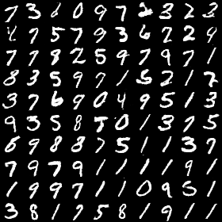

## DCGAN-keras ##

Implementation of http://arxiv.org/abs/1511.06434 with the (awesome) [keras](https://github.com/fchollet/keras) library, for generating artificial images with deep learning.

This trains two adversarial deep learning models on real images, in order to produce artificial images that look real.

The generator model tries to produce images that look real and get a high score from the discriminator.

The discriminator model tries to tell apart between real images and artificial images from the generator.

---
I reorganize the codes from  this repository [Keras-dcgan](https://github.com/jacobgil/keras-dcgan), the original model can only run on keras with theano, I add some judgement statements, so the model can run on keras with tensorflow or theano. In addition, I add some codes to plot the accuracy of Generator and Discriminator. Finally, the epochs of the training process can be set with the parameter *epoch_num*.

---

## Usage

**Training:**

 `python dcgan.py --mode train --batch_size <batch_size> --epoch_num <epoch_num>`

  *For example* : `python dcgan.py --mode train --batch_size 128 --epoch_num 200`

**Image generation:**

`python dcgan.py --mode generate --batch_size <batch_size>`

`python dcgan.py --mode generate --batch_size <batch_size> --nice` : top 5% images according to discriminator

*For exampel* :`python dcgan.py --mode generate --batch_size 128 --nice`

---

## Result

**generated images :** 

**train process :**

## Reference
[Keras-dcgan](https://github.com/jacobgil/keras-dcgan)

---
